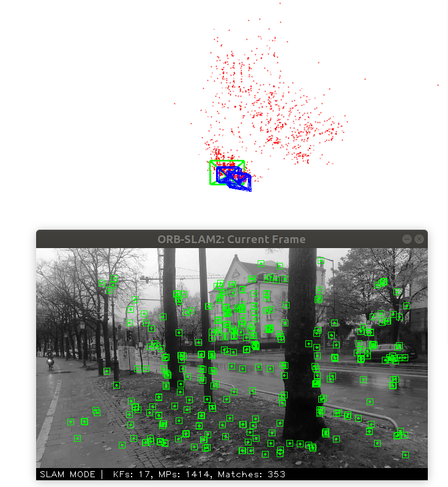
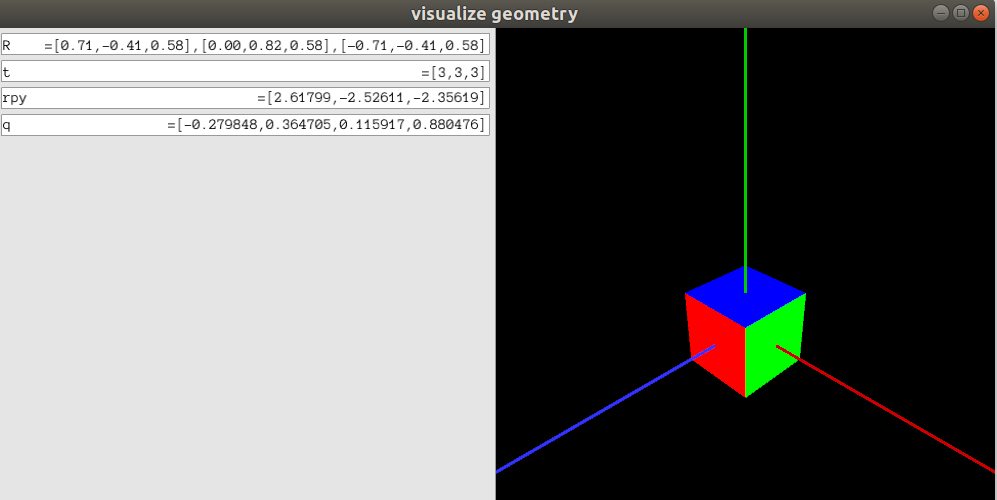
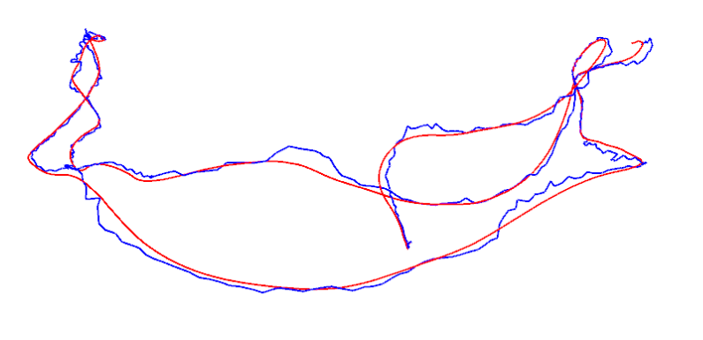
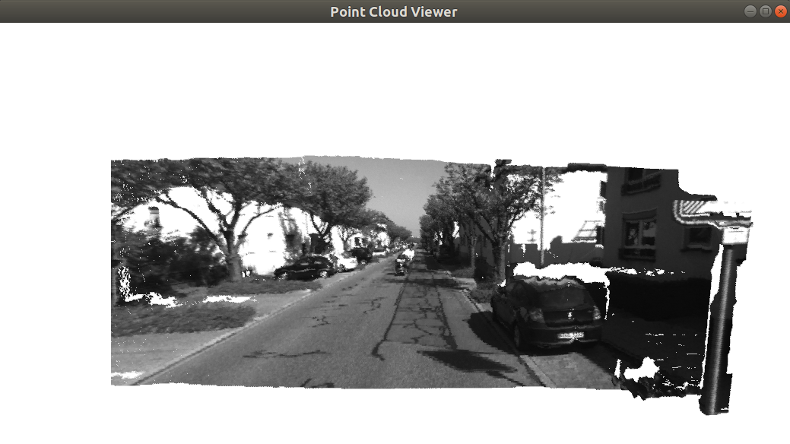
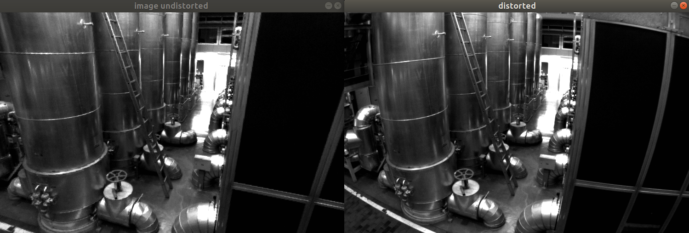

# Visual-SLAM-Notes
This is collection of basis of Visual SLAM, which is aligned the book from Xiang Gao https://github.com/gaoxiang12/slambook-en

# 1. Intro

Running my video with **ORB-SLAM 2[https://github.com/weihang-li/ORB_SLAM2/tree/master/Examples/myvideo]**

# 2. Eigen & Geometry Visualization

# 3. Trajectory Estimation

# 4. Camera Model & Nonlinear Optimization

